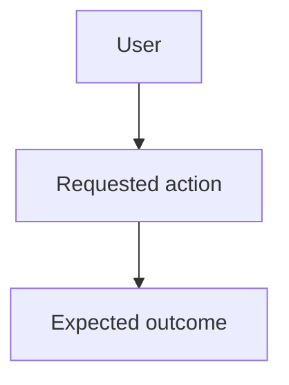

# Jira User Story

Use this skill when the user asks to create, refine, or review a Jira user story, backlog item, feature ticket, or epic description.

## Workflow

- Clarify the actor, goal, business value, scope, dependencies, and constraints before finalizing the story.
- Separate requirements from implementation notes.
- Keep acceptance and success criteria testable.
- Include a Mermaid diagram when it clarifies flow, architecture, states, or dependencies.
- Avoid inventing product requirements when details are missing; mark unknowns as assumptions or open questions.

## Story Template

````markdown
## Subject
<Short action-oriented Jira title>

## User Story
As a <user or actor>, I want <capability>, so that <business or user value>.

## Info
- Context:
- Scope:
- Out of scope:
- Dependencies:
- Assumptions:

## Mermaid Diagram


## Motivation
- Why this matters:
- Problem being solved:
- Expected impact:

## Success Criteria
-

## Definition of Done
- Requirements are implemented.
- Automated tests cover the main behavior and relevant edge cases.
- Documentation or release notes are updated when needed.
- Security, accessibility, performance, and observability impacts are considered.
- Product owner or stakeholder acceptance is completed.

## Checklist
- [ ] Confirm requirements and assumptions.
- [ ] Validate UX/API/data behavior.
- [ ] Implement the change.
- [ ] Add or update tests.
- [ ] Run relevant validation commands.
- [ ] Update documentation if needed.
- [ ] Prepare rollout or migration notes if needed.
````

## Quality Rules

- Subject should be concise, searchable, and written as an outcome or action.
- Info should include enough context for engineering, QA, and product to work without side conversations.
- Motivation should explain why the work is valuable, not restate the implementation.
- Success criteria should describe measurable outcomes, not task steps.
- Definition of Done should describe completion standards shared across stories.
- Checklist should describe execution tasks that can be checked off during delivery.

## Response Style

- Return Jira-ready Markdown unless the user asks for another format.
- Keep wording direct and implementation-neutral where possible.
- Include open questions at the end when required details are missing.
