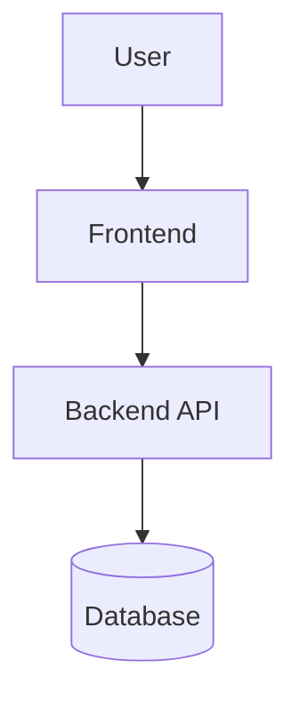

# README Documentation

Use this skill when creating or improving a structured `README.md` or high-level project documentation.

## Workflow

- Review the project before writing: source layout, package files, build scripts, configuration, tests, deployment files, and existing docs.
- Explain what the project does, who it is for, and the main problem it solves.
- Document actual behavior from the codebase instead of guessing.
- Keep explanations clear, practical, and useful for a new developer or operator.
- Prefer concise sections with examples over long generic descriptions.

## Recommended README Structure

- Project title and short description.
- Table of contents for medium or large projects.
- Features and core capabilities.
- Architecture overview with Mermaid diagrams where useful.
- Project structure and important files.
- Setup requirements and supported versions.
- Installation and configuration steps.
- Running locally, testing, linting, building, and deployment.
- Main functions, modules, services, APIs, or commands.
- Environment variables and configuration reference.
- Common workflows and examples.
- Pitfalls, gotchas, limitations, and troubleshooting.
- Best practices for development, security, testing, and operations.
- Versioning, changelog, release, or compatibility notes.
- Contributing and maintenance notes when relevant.

## Mermaid Diagrams

- Use Mermaid only when it clarifies architecture, data flow, deployment, sequence, or dependency relationships.
- Keep diagrams valid and simple enough to render in GitHub Markdown.
- Prefer `flowchart TD` for architecture and flow diagrams.
- Prefer `sequenceDiagram` for request or event flows.
- Prefer `erDiagram` for database relationships.
- Add a short explanation before or after each diagram.

Example:

## Quality Checks

- Verify commands match actual project scripts and tooling.
- Verify package, runtime, framework, database, and service versions from lockfiles, manifests, Dockerfiles, or docs.
- Verify links, paths, filenames, and environment variable names.
- Call out missing information instead of inventing details.
- Make pitfalls specific to this project, not generic warnings.

## Response Style

- State what project files were reviewed.
- Summarize major documentation changes.
- Mention any assumptions, missing details, or commands that could not be verified.
